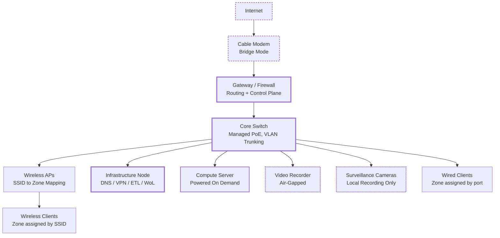

# Midgard

**A home network built and run the way production infrastructure is.** Nine VLANs
enforcing seven trust zones, default-deny between all of them, recursive DNS that no
third party ever sees a query from, and surveillance that has no route to the internet
at all.

Named for the walled middle enclosure of Norse cosmology: a segmented, defended home.

> **Everything denied by default. Anything allowed is explicit, documented, and
> intentional.**

## Topology

The ISP's modem runs in bridge mode, so a single gateway under local control makes
every routing and filtering decision. Wired clients get a zone by switch port,
wireless clients by which SSID they join.

## Segmentation

A flat network is a single-exploit environment: one compromised smart bulb sits on the
same broadcast domain as the work laptop, the children's tablets and the cameras. Each
zone here is a trust boundary, and the default rule between any two of them is deny.

| Zone | Holds | Trust | Internet |
|---|---|---|---|
| The Fifth Dimension | Network infrastructure, management plane | Highest | Yes |
| Beyond the Pale | Trusted personal devices with admin access | High | Yes |
| Sector 51 | Employer-managed work devices | Isolated | Yes |
| Junior Dimension | Children's devices, content-filtered | Restricted | Filtered |
| The Viewing Chamber | Televisions and streaming devices | Low | Yes |
| The Loading Dock | Media ingest and download quarantine | Low | Yes |
| The Machine Realm | IoT and smart home | Very low | Limited |
| The Outer Limits | Guest devices | Lowest | Yes |
| The Surveillance Sector | Cameras and recorder | Special | **Blocked** |

Zones are named after *The Twilight Zone*, which is a memory aid rather than a joke.
"Does this belong in The Machine Realm or Junior Dimension?" is a question anyone in
the house can answer from the device's purpose. "Is this the first VLAN or the third?"
is not.

Everything permitted is short and written down: infrastructure reaches everything for
management, trusted devices reach infrastructure and the cameras, media zones reach
media services, everything reaches DNS, and VPN clients land in the trusted zone. Two
rules are worth stating plainly. Work devices cannot reach personal ones, which
protects the employer as much as the household. And the surveillance zone is blocked
outbound entirely, so footage never leaves the building.

## Four decisions and what they cost

A decision with no downside was not a decision, so the cost is stated for each.

**Bridge-mode modem.** No double NAT and no vendor-controlled routing layer above the
firewall rules. The cost is that the gateway becomes the only thing between the
network and the internet, with no accidental second layer to fall back on.

**On-demand compute.** The compute server draws real power at idle and its workloads
are episodic, so the infrastructure node manages its power lifecycle instead of
leaving it running. First use pays for that in startup latency, and the server cannot
come up at all if the infrastructure node is down.

**Air-gapped surveillance.** The cameras have no internet access. Not filtered, not
restricted. None. Remote viewing goes over the VPN and then locally, which costs
convenience: no app that just works from anywhere, and every viewer needs a VPN
config. That trade was made deliberately, because a camera network that phones out is
one whose footage is somebody else's problem.

**A single infrastructure node.** DNS, VPN, telemetry and power management run on one
always-on device. This is an accepted single point of failure, and the blast radius
was reasoned about before it was accepted: if it dies, the gateway keeps routing and
the network keeps working. What is lost is filtering and VPN access. Degraded, not
down. That distinction is why the trade-off is acceptable in a house and would not be
in a data centre.

## DNS sovereignty

Filtering resolves locally, then recursion goes straight to the authoritative
nameservers. **No third-party resolver ever sees a query from this network:** not the
ISP, not Cloudflare, not Google. There is no forwarder because there is no forwarding.
DNSSEC is validated.

The distinction that matters is between a filter and a control. A filter is what a
device uses when it chooses to. Encrypted DNS and direct resolver queries are blocked
at the firewall, so a television that ships with its own hardcoded resolver cannot
route around any of it. A device on this network resolves through the local stack or
it does not resolve.

## Telemetry

A Python ETL runs on a systemd timer every fifteen minutes, pulling device state,
client connections, traffic statistics and events from the controller's API into a
local PostgreSQL instance. It drives alerting on devices dropping offline and
unfamiliar clients appearing, plus historical traffic and uptime analysis.

The pattern is the same one used professionally: scheduled extraction from an API into
a relational store, with a history worth querying rather than a dashboard worth
glancing at. The difference between monitoring and telemetry is whether you can ask
questions about last month.

## Why there are no addresses here

This repository publishes zone names and not VLAN numbers, component roles and not
addresses. That is a security control, not an incomplete draft.

The network it describes is live and carries a family's traffic, so the working
documentation stays private. Publishing an architecture without publishing a target is
the whole exercise, and it is enforced rather than promised: a blocking CI check greps
every push for addresses, subnets, MACs, VLAN identifiers, hostnames, credentials and
key material. See [CONTRIBUTING.md](CONTRIBUTING.md).

This is an architecture showcase, not a penetration test invitation.

## What's in here

There is no build, no compose stack and no entry point. This repository is
documentation and diagrams, and by design it always will be.

| Path | What |
|---|---|
| `docs/CASE_STUDY.md` | The full write-up |
| `docs/diagrams/` | Mermaid sources for the topology, trust hierarchy, DNS chain and service map |
| `docs/source-pages/` | The original site pages, kept verbatim |
| `CONTRIBUTING.md` | The sanitisation rule, in full |
| `project.yaml` | How this renders on lukeudell.com |
